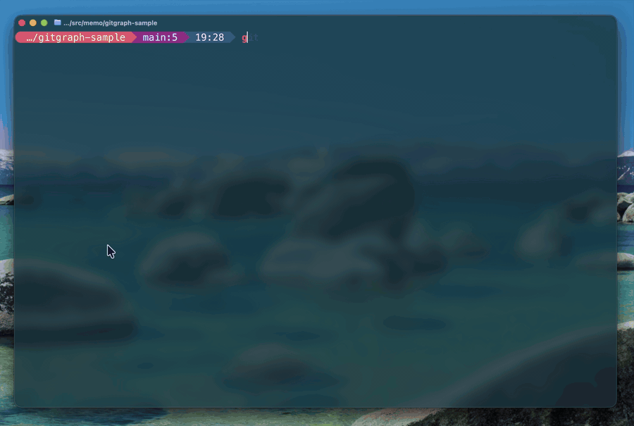

# giv

A terminal (TUI) git visualizer written in pure Rust.

All git operations shell out to the `git` binary; no libgit2 dependency.



## Install

Requirements:

- Git available on `PATH`
- Rust 1.88 or newer when building from source

### Homebrew (macOS / Linux)

```sh
brew tap shogoisaji/giv
brew install giv
```

### Build from source

```sh
git clone <repo-url>
cd giv
cargo build --release
# Binary is at target/release/giv
```

### Install into Cargo bin path

```sh
cargo install --path .
# Binary is installed to ~/.cargo/bin/giv
```

## Usage

```sh
giv [PATH]            # Launch TUI on the repo at PATH (default: current dir)
```

## Modes

giv has six modes, switched with number keys:

| Key | Mode       | Description                                 |
|-----|------------|---------------------------------------------|
| `1` | Status     | Working tree status + staged/unstaged diff  |
| `2` | Graph      | Commit graph with lane visualization        |
| `3` | Branches   | Local and remote branches                   |
| `4` | Worktrees  | Git worktrees                               |
| `5` | Stashes    | Stash list                                  |
| `6` | Inspect    | Enter any commit ref (sha / branch / `HEAD~1`) and view its full diff |

In **Inspect** mode, press `i` (or `Enter`) to open the prompt, type a ref, and
`Enter` to show that commit's metadata and diff. Use `↑`/`↓` to scroll.

### Responsive layout

giv adapts its pane layout to the terminal width:

- **Narrow terminals (< 150 cols):** the historical two-pane layout — a list on
  the left and a detail/diff panel on the right. `Tab` cycles focus between the
  two panes.
- **Wide terminals (>= 150 cols):** Status and Graph modes grow a third pane.
  The left column splits vertically into **Changes** (top) + **Graph** (bottom),
  and the right column is the **Diff** / detail panel (full height):

  ```
  +----------+---------+
  | Changes  |         |
  |  (top)   |  Diff   |
  +----------+ (right) |
  | Graph    |         |
  | (bottom) |         |
  +----------+---------+
  ```

  `Tab` cycles `Left → Middle → Right → Left` (Changes → Graph → Diff). The diff
  pane always reflects whichever list panel holds focus — the selected commit's
  diff when the graph is focused, the working-tree file diff when the change
  list is focused. Other modes (Branches / Worktrees / Stashes / Inspect) keep
  the two-pane layout even when wide, since they have no natural third pane.

**Focus-weighted split:** the focused pane always gets the most space. In
two-pane mode the focused pane gets 65%. In three-pane mode the left column
widens to 60% when Changes or Graph is focused (and the focused half grows),
or the right column widens to 60% when Diff is focused. Tabbing shifts the
weight smoothly; the pane structure never changes, so your eyes stay on the
content without reflow-induced jumps.

### Branch compare

In **Graph** mode, press `=` to compare two branches. A dialog opens with both
**base** and **target** fields visible side by side:

1. Type in the **base** field to filter the branch list (e.g. type `main`).
2. Press `Tab` to switch to the **target** field, type to filter (e.g. `feature`).
3. Press `Enter` to compare — the first matching branch for each field is used.

The graph narrows to `base..target` commits (only what the target branch has on
top of base), and the diff panel shows `git diff base...target` — the cumulative
changes the target branch introduces. The status bar shows
`Comparing: base..target (N commits)`. Press `Esc` or `=` again to exit compare
mode and restore the full graph.

### Mouse click-to-jump

Mouse capture is enabled by default. Everything is clickable:

- **Mode tabs** (1:Status, 2:Graph, …) — click to switch mode instantly.
- **List rows** (Changes, Graph, Branches, Worktrees, Stashes) — click to jump
  the cursor to that row and focus the panel.
- **Diff panel** — click to focus it for scroll-wheel navigation.

Press `M` to toggle mouse capture off when you need native click-drag text
selection.

## Keybindings

### Global (all modes)

| Key      | Action                          |
|----------|---------------------------------|
| `q`      | Quit                            |
| `r`      | Refresh                         |
| `?`      | Toggle help overlay             |
| `1`–`6`  | Switch mode                     |
| `Tab`    | Switch panel focus              |
| `:`      | Open command palette            |
| `/`      | Open incremental search bar     |
| `T`      | Cycle through themes            |
| `C`      | Continue in-progress git op     |
| `A`      | Abort in-progress git op when one is active |

### Navigation (all modes)

| Key           | Action         |
|---------------|----------------|
| `j` / `↓`    | Move down      |
| `k` / `↑`    | Move up        |
| `g`           | Jump to top    |
| `G`           | Jump to bottom |
| `PgDn`        | Page down      |
| `PgUp`        | Page up        |
| `Enter`       | Select / show diff |

### Status mode

| Key        | Action                          |
|------------|---------------------------------|
| `Space`    | Stage / unstage selected file   |
| `a`        | Stage all changes               |
| `A`        | Unstage all changes (or abort if a git op is active) |
| `u`        | Unstage selected                |
| `c`        | Open commit dialog              |
| `d`        | Scroll diff down                |
| `Ctrl-u`   | Scroll diff up                  |
| `R`        | Mark conflict as resolved       |
| `s`        | Stash save (open prompt)        |
| `t`        | Create tag                      |
| `f`        | Fetch                           |
| `F`        | Pull                            |
| `P`        | Push                            |

### Graph mode

| Key  | Action                                  |
|------|-----------------------------------------|
| `Enter` | Show diff for selected commit        |
| `c`  | Cherry-pick selected commit             |
| `v`  | Revert selected commit                  |
| `x`  | Open reset menu (soft / mixed / hard)   |
| `b`  | Rebase HEAD onto selected commit        |
| `i`  | Interactive rebase from selected commit |
| `t`  | Create tag on selected commit           |
| `D`  | Delete selected tag                     |
| `y`  | Copy (yank) commit SHA via OSC 52       |
| `n`  | Jump to next search match               |
| `=`  | Compare branches (`base..target` picker)|
| `a`  | Toggle all branches / current branch only |
| `m`  | Toggle first-parent merge folding       |
| `l`  | Toggle branch lens against main         |
| `f`  | Fetch                                   |
| `F`  | Pull                                    |
| `P`  | Push                                    |

### Branches mode

| Key          | Action                       |
|--------------|------------------------------|
| `Enter`/`Space` | Checkout branch           |
| `n`          | New branch (dialog)          |
| `d`          | Delete branch                |
| `m`          | Merge into HEAD              |
| `r`          | Rebase HEAD onto branch      |
| `y`          | Copy branch name via OSC 52  |
| `f`/`F`/`P` | Fetch / Pull / Push          |

### Worktrees mode

| Key   | Action                   |
|-------|--------------------------|
| `Enter` | Switch to worktree (cd) |
| `a`   | Add worktree (dialog)    |
| `d`   | Remove worktree          |
| `p`   | Prune stale worktrees    |

### Stashes mode

| Key         | Action                        |
|-------------|-------------------------------|
| `Enter`/`Space` | Apply stash (keep in list) |
| `p`         | Pop stash (apply + drop)     |
| `d`         | Drop stash (confirm first)   |
| `s`         | Stash save (open prompt)     |

### Interactive rebase overlay

| Key       | Action                      |
|-----------|-----------------------------|
| `j`/`k`   | Move cursor                 |
| `J`/`K`   | Reorder entries             |
| `p`       | Set command: pick           |
| `r`       | Set command: reword         |
| `e`       | Set command: edit           |
| `s`       | Set command: squash         |
| `f`       | Set command: fixup          |
| `d`       | Set command: drop           |
| `Enter`   | Execute the rebase          |
| `Esc`/`q` | Cancel                      |

### Dialogs

| Key           | Action             |
|---------------|--------------------|
| `Enter`       | Confirm            |
| `Esc`         | Cancel             |
| `Backspace`   | Delete character   |
| `Ctrl+Enter`  | Submit commit msg  |

## Themes

Four built-in themes are available. Set the theme in the config file or cycle
through them interactively with `T`.

| Name          | Description                  |
|---------------|------------------------------|
| `tokyonight`  | Tokyo Night (default)        |
| `catppuccin`  | Catppuccin Mocha (warm dark) |
| `nord`        | Nord (arctic blue)           |
| `gruvbox`     | Gruvbox Dark (retro groove)  |

## Configuration

Create `~/.config/giv/config.toml` to override defaults:

```toml
# Active color theme.
# Available values: "tokyonight" (default), "catppuccin", "nord", "gruvbox"
theme = "tokyonight"

# Commit graph density.
# "spacious" (default) — 2 rows per commit, easier to read lane connectors.
# "compact"            — 1 row per commit, shows more history at once.
graph_mode = "spacious"

# Diff presentation style.
# "unified"    (default) — single-pane unified diff (like git diff).
# "side-by-side"         — two-pane view (future; falls back to unified).
diff_view = "unified"
```

## Architecture

giv follows an Elm-style architecture (model → `update(action)` → `Effect`,
view as a pure function of the model). The source is organised by **feature**
(one directory per mode) over a shared **core**:

```
src/
  main.rs            # thin CLI entry (clap) → core::runtime
  core/              # shared foundation
    app.rs           # App model, Mode, UiState, RepoState
    action.rs        # Action enum  ·  effect.rs  ·  event.rs
    update.rs        # central dispatcher → delegates to features::<mode>::update
    keymap.rs        # global keys → delegates to features::<mode>::keymap
    runtime.rs       # terminal setup + main event loop
    dialog.rs · palette.rs · search.rs · config.rs · theme.rs · clipboard.rs
  git/               # backend (data layer)
    mod.rs (GitBackend trait) · types.rs · diff.rs
    cli/ mod.rs (CliBackend + GitBackend impl) · parse.rs (pure parsers + tests)
  features/          # one directory per mode (vertical slice)
    status/ graph/ branches/ worktrees/ stashes/ inspect/
      └ view.rs · update.rs · keymap.rs   (graph also: layout/render/rebase_todo)
  ui/                # shared presentation
    mod.rs (root view, tabs, dispatch) · chrome/ · overlay/ · diff_view.rs
    layout.rs (responsive breakpoint + focus-cycling pure logic)
    dashboard.rs (wide-terminal 3-pane Graph|Changes|Diff composition)
```

When adding a mode-specific behaviour, edit that feature's `update.rs` /
`keymap.rs` / `view.rs`; the central `core::update` and `core::keymap` are thin
dispatchers that route to it. Cross-cutting concerns (navigation, dialogs, the
confirm executor, palette, search) live in `core`.

## Project docs

- [CHANGELOG.md](CHANGELOG.md)
- [CONTRIBUTING.md](CONTRIBUTING.md)
- [SECURITY.md](SECURITY.md)
- [Homebrew release checklist](docs/homebrew-release.md)

## License

MIT. See [LICENSE](LICENSE).
